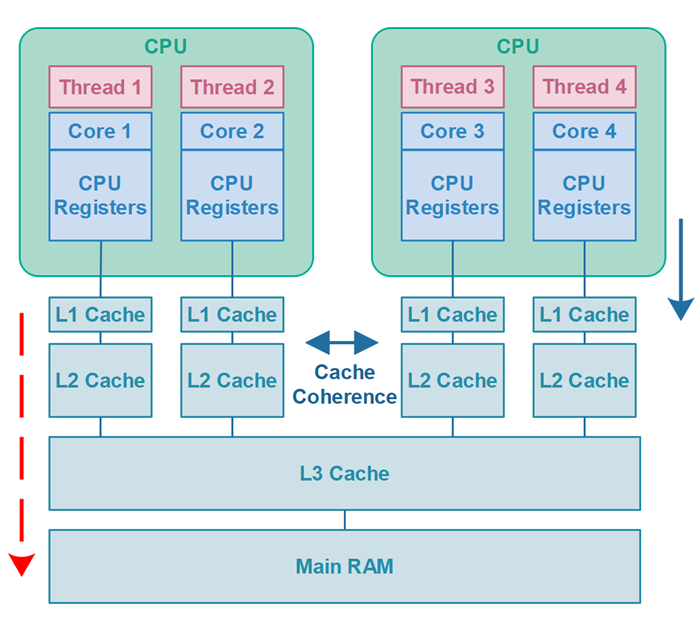

# Cache Coherence

`Cache coherence` is a mechanism that ensures that all CPU cores see the most recent value of a variable stored in cache, even if it hasn't been flushed to main memory yet. This means that when a core writes to a variable, the updated value can be visible to other cores immediately through cache coherence, even if the value hasn't yet reached main memory.

What actually happens is, that all variables visible to the thread which are stored in CPU registers **will be flushed** to main `RAM (main memory)`. On the way to main RAM the variables **may be stored** in the `CPU cache`. The CPU / motherboard then uses its `cache coherence` methods to make sure that all other CPUs caches can see the variables in the first CPUs cache.

The hardware **may even choose not to flush** the variables all the way to main memory but only keep it in the `CPU cache` - until the CPU cache storing the variables is **needed for other data**. At that time the CPU cache can then be flushed to main memory. However, for the code running on the CPU this is not visible. As long as it gets the data it requests from any given memory address, it doesn't matter if the returned data only exists in the CPU cache, or whether it is also exists in main RAM.

Below is a diagram illustrating about the Cache Coherency concept. The red, dashed arrow on the left represents my false statement from other tutorials - that variables were flushed from CPU cache to main RAM. The arrow on the right represents what actually happens - that variables are flushed from CPU registers to the CPU cache.

