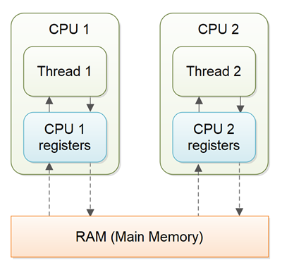
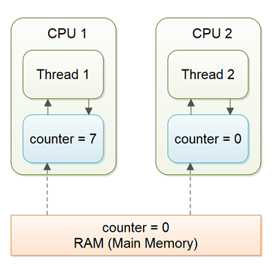
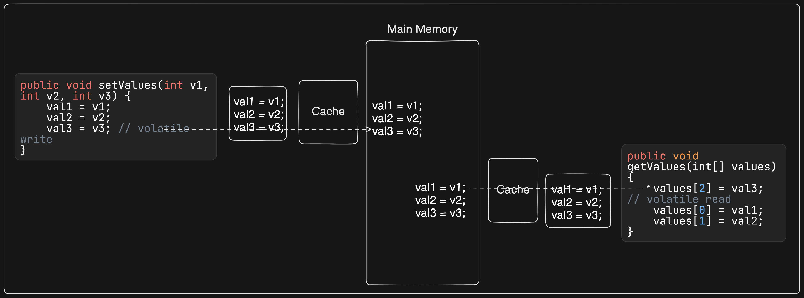
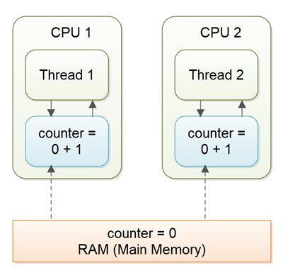

## Java Volatile keyword

The `volatile` keyword in Java is a special keyword that can be applied to a variable to ensure visibility and consistency across multiple threads. This keyword tells the Java Virtual Machine (JVM) that the variable must always be read directly from the main memory, and any changes to the variable must be written directly back to the main memory immediately.

## Declaring a Volatile Variable

### Example:
```java
public class Example {
    private volatile boolean hasNewObject;
    private Object object;
}
```
By adding the `volatile` keyword to the `hasNewObject` variable, you inform the JVM to always read this variable from the main memory and not to cache its value in CPU registers.

## Non-volatile Variable Visibility Problems

If a variable is not declared as `volatile`, there is no guarantee about how often the variable will be read from the main memory or written back to the main memory. This can lead to visibility issues in a multithreaded environment.



### Example Scenario Without Volatile:
```java
public class SharedObject {
    public int counter = 0;
}
```

For example there are two threads, if `counter` variable is not set to `volatile`, Thread 1 might set `counter` to `true` but keep this change only in its `CPU cache`. Thread 2 might not see this change because it reads `counter` from its own `CPU cache`, leading to inconsistent states.



The problem with threads not seeing the latest value of a variable because it has not yet been written back to main memory by another thread, is called a `visibility` problem. The updates of one thread are not visible to other threads.

## Java Volatile Visibility Guarantee

### Visibility Guarantee

When a variable is declared as `volatile`, any write to this variable will be directly written to the `main memory`. Additionally, `all other variables` visible to the thread will also be `flushed` to the main memory.

### Example:
```java
public class Example {
    private volatile boolean hasNewObject; //declared as volatile
    private Object object;

    public void setObject(Object newObj) {
        this.object = newObj; //also flushed
        this.hasNewObject = true; //directly written into main memory
    }

    public boolean getObject() {
        while (!this.hasNewObject) {
            // busy-wait
        }
        return this.hasNewObject;
    }
}
```

In this example, once `hasNewObject` is set to `true` by Thread 1, this change is immediately visible to Thread 2, ensuring that both `object` and `hasNewObject` are read from the main memory. All reads of the `hasNewObject` variable will be directly read from the main memory.

## Full volatile Visibility Guarantee

Actually, the visibility guarantee of `Java volatile` goes beyond the volatile variable itself. The visibility guarantee is as follows:

1. If `Thread A` writes to a volatile variable and `Thread B` subsequently reads the same volatile variable, then **all variables visible** to `Thread A` **before** writing the volatile variable, will also be visible to `Thread B` after it has read the volatile variable.
2. If `Thread A` reads a volatile variable, then **all variables visible** to `Thread A` when reading the volatile variable will also be `re-read` from main memory.



## Instruction Reordering

The Java compiler and JVM are allowed to reorder instructions to optimize performance as long as the semantic meaning of the program is not changed. However, this reordering can sometimes break the visibility guarantees provided by `volatile`.

### Example of Reordering Issue:
```java
public class Exchanger {
    private int val1;
    private int val2;
    private volatile int val3;

    public void setValues(int v1, int v2, int v3) {
        val1 = v1;
        val2 = v2;
        val3 = v3; // volatile write
    }

    public void getValues(int[] values) {
        values[2] = val3; // volatile read
        values[0] = val1;
        values[1] = val2;
    }
}
```

In this example, if `val1` and `val2` are set before `val3`, the writes to `val1` and `val2` are not immediately visible to other threads. If the instructions are reordered such that `val3` is set before `val1` and `val2`, then the visibility guarantees can be broken.

```java
public void setValues(int v1, int v2, int v3) {
        val3 = v3; // volatile write(reordered)

        val1 = v1;
        val2 = v2; // these two variable might not flushed to the main memory.
    }
```

## Java Volatile Happens-Before Guarantee

To prevent issues caused by instruction reordering, the `volatile` keyword also provides a happens-before guarantee. This means all writes to a `volatile` variable happen before any subsequent reads of that `volatile` variable.

### Example:
```java
public class Example {
    private volatile boolean flag;
    private int value;

    public void writer() {
        value = 42; // 1
        flag = true; // 2 (volatile write)
    }

    public void reader() {
        if (flag) { // 3 (volatile read)
            System.out.println(value); // 4
        }
    }
}
```

In this example, the write to `value` (1) happens-before the write to `flag` (2), and the read of `flag` (3) happens-before the read of `value` (4). This ensures the correct value of `value` is seen by the reader thread. To address the instruction reordering challenge, the Java volatile keyword gives a `happens-before` guarantee, in addition to the visibility guarantee. This guarantess that
- Reads from and writes to other variables cannot be reordered to occur after a write to a volatile variable, if the reads / writes originally occurred before the write to the volatile variable.

## Java Volatile Performance Overhead

Using the `volatile` keyword incurs a small performance overhead because it forces the JVM to bypass the CPU cache and directly interact with the main memory. This is why `volatile` should only be used when necessary, i.e., when you need visibility guarantees between threads.

## Java Volatile is Not Always Enough

As soon as a thread needs to first read the value of a volatile variable, and based on that value generate a new value for the shared volatile variable, a volatile variable is no longer enough to guarantee correct `visibility`. The short time gap in between the reading of the volatile variable and the writing of its new value, creates an `race condition` where multiple threads might read the same value of the volatile variable, generate a new value for the variable, and when writing the value back to main memory - overwrite each other's values.

The situation where multiple threads are `incrementing` the same counter is exactly such a situation where a volatile variable is not enough. Increment is not an atomic operation. It consist of **read, modify and write**. The following sections explain this case in more detail.

Imagine if `Thread 1` reads a shared counter variable with the `value 0` into its CPU register, `increment it to 1` and not write the changed value back into main memory. `Thread 2` could then read the same counter variable from main memory where the value of the variable is `still 0`, into its own CPU register. `Thread 2` could then also increment the counter `to 1`, and also not write it back to main memory. This situation is illustrated in the diagram below:



### Example of Insufficient Volatile:
```java
public class Counter {
    private volatile int count;

    public void increment() {
        if (count != 10) {
            count++; // not atomic
        }
    }
}
```

`Thread 1` and `Thread 2` are now practically `out of sync`. The real value of the shared counter variable should have been 2, but each of the threads has the `value 1` for the variable in their CPU registers, and in main memory the value is still 0. It is a mess! Even if the threads eventually write their value for the shared counter variable back to main memory, the value will be wrong.

### Solution:
Use `synchronized` methods or blocks, or use atomic classes from `java.util.concurrent.atomic`.

### Example with AtomicInteger:
```java
import java.util.concurrent.atomic.AtomicInteger;

public class Counter {
    private AtomicInteger count = new AtomicInteger();

    public void increment() {
        if (count.get() != 10) {
            count.incrementAndGet();
        }
    }
}
```

This ensures that the increment operation is atomic and visible to all threads.

## Performance Considerations of volatile

Reading and writing of volatile variables causes the variable to be read or written to main memory. Reading from and writing to `main memory` is **more exprensive** than accessing the `CPU register`. Accessing volatile variables also `prevent` instruction reordering which is a normal performance enhancement technique. Thus, only use volatile variables when you really need to enforce visibility of variables.

## Conclusion

The `volatile` keyword in Java is a powerful tool for ensuring visibility of shared variables across threads. However, it should be used judiciously and in combination with other synchronization mechanisms when necessary to ensure correct and efficient concurrent behavior.

## Further Reading

- Java Concurrency in Practice by Brian Goetz
- The Java Tutorials by Oracle on Concurrency
- Java Language Specification

This README provides an overview of the `volatile` keyword in Java, its proper usage, and its limitations, helping you understand how to use it effectively in your concurrent applications.